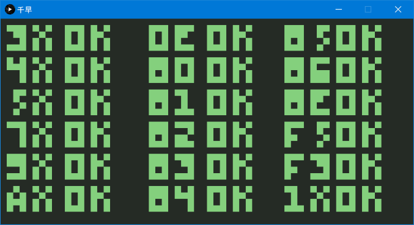

# Chihaya (千早)


> “If I can be the best in the world at something, then I think it's worth a shot.” - Chihaya Ayase
>
> [Chihayafuru, by Yuki Suetsugu](https://en.wikipedia.org/wiki/Chihayafuru)

A CHIP-8 emulator written in Clojure.

### Building

#### Prerequisites

- [JDK 8](https://www.oracle.com/java/technologies/javase-jdk8-downloads.html)
- [Clojure](https://clojure.org/guides/getting_started)

#### Compiling

```bash
$ clj -Auberjar
[uberdeps] Packaged target/chihaya-0.1.0.jar in 2786 ms
```

#### Running

```bash
$ java -cp target/chihaya-0.1.0.jar clojure.main -m com.unsafepointer.chihaya.core
Usage: chihaya [OPTION] ... <romfile>
  -i, --instructions         Output instructions to stdout
  -f, --frequency FREQ  800  CPU clock rate
  -h, --help
```

#### CPU Tests

[corax89/chip8-test-rom](https://github.com/corax89/chip8-test-rom): test_opcode.ch8 (SHA1: f1cfcffe1937ed6dd6eeed1a7f85dfc777bda700)



### Acknowledgments

This emulator, like many others, is based on the [Cowgod's Chip-8 Technical Reference v1.0](http://devernay.free.fr/hacks/chip8/C8TECH10.HTM). For ease of access and review purposes, relevant parts of the specification are pasted before the implementation.
